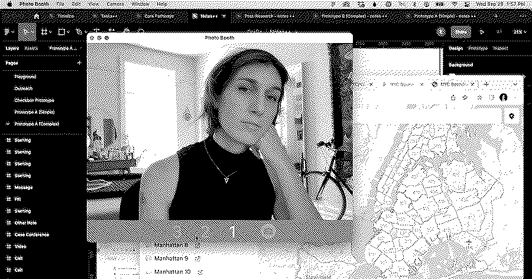

<div align="center">

 [](https://github.com/evadecker/evadecker.com/actions/workflows/playwright.yml) [](https://github.com/evadecker/evadecker.com/actions/workflows/w3c.yml) 

</div>

# Eva Decker

This is the source code for https://evadecker.com, designed, coded, and written by Eva—that's me! It's a place for me to share notes and learn in public. I try to update things regularly.

You're welcome to fork this site, use it as inspiration, and modify things for your own projects—just don't steal it or try to claim my work as your own. That's not cool.

For information about the technology and tools behind this site, visit [https://evadecker.com/colophon](https://evadecker.com/colophon).

## Getting Started

This site uses the [pnpm](https://pnpm.io) package manager because it's faster than npm and produces more readable, diff-able lock files. If you've used `npm` the `pnpm` command is the same as `npm run`. So to get started, clone the repo and run:

```bash
pnpm dev
```

Other scripts in [package.json](/package.json) can also be run with `pnpm`.

## Notes To Self

Some shortcuts and workflows to remember.

### Dates

Frontmatter for content should include a required `datePublished` and an optional `dateModified` field. Dates should be ISO-formatted datetime strings and *include the time zone of publishing*, like this: `2023-09-26 03:47:00-04:00`.

It's important to include the time zone (EDT: `-04:00`, EST: `-05:00`) so that relative dates (like "4 days ago") can display correctly depending on a user's local time zone, and because I may not always write from the East Coast.

To insert dates in the frontmatter of Markdown files, use the [Insert Date String](https://marketplace.visualstudio.com/items?itemName=jsynowiec.vscode-insertdatestring) from VS Code and press `command` + `shift` + `I`.

> [!IMPORTANT]  
> Remember to update `dateModified` when revising articles! It's a mildly annoying manual step, yes, but it's easier (for now) than building something to handle setting dates automatically.

### Adding New Dithered Images



The primary images on pages use Atkinson dithering. I'd like to automate this pipeline at some point, but it's manual for now. Here's how to do it.

1. Grab your source image and scale the width to 1200px using an app like Preview. Crop the height to 630px. 1200&times;630 is the aspect ratio used for Open Graph images and this ratio is currently enforced for header images in order to prevent layout shift on image load.
2. Open up https://app.dithermark.com and upload the cropped image.
3. Change the settings to "BW Dither" and change the algorithm to "Atkinson".
4. (Optional) Drag the threshold slider until you have a result that feels nice.
5. Export the file as `.webp`. I like to prefix the size at the end of the image, like `img1200.webp`.
6. Resize your image again, down to 900px. Repeat the steps in Dithermark for the new image and export another `.webp`.
7. Repeat the same steps for 600px.
8. Add the images to the content directory and link them from the frontmatter as an array, [like this](https://github.com/evadecker/evadecker.com/blob/9257f833528852114ffa88cb4907113697072b43/src/content/pages/about/index.md?plain=1#L6).
9. Add an `imgAlt` in the frontmatter.
