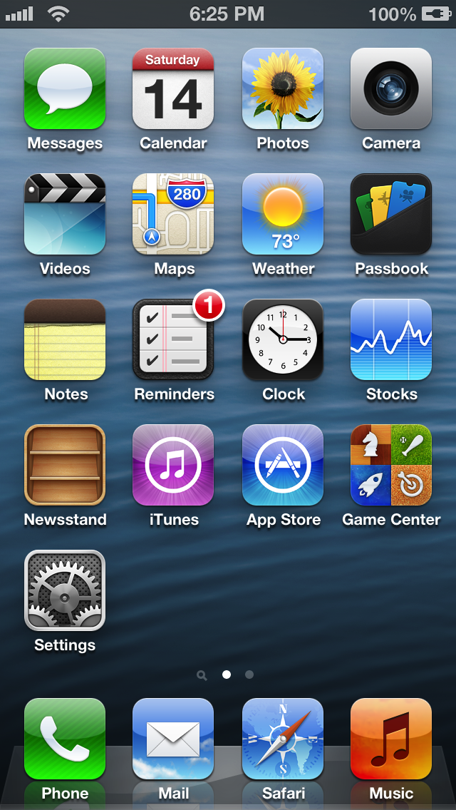
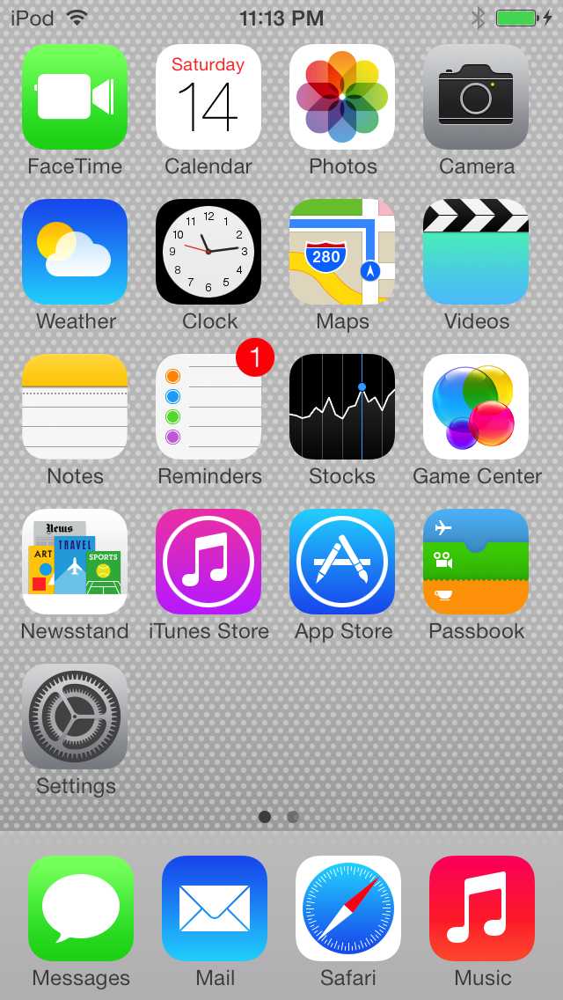
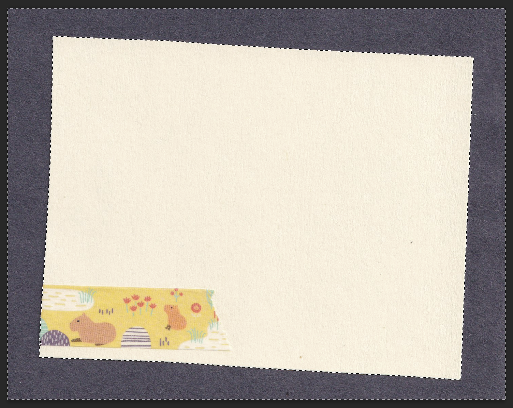

This weekend, I added a new feature to my site. It's an old-school kind of webpage—something I've always wanted to create, but never really had the tools for until now.

It's a [guestbook](/guestbook).

In the guestbook, anyone can write and publish a short message accompanying a name and optional URL. Once submitted, the message gets published to the top of the page for everyone to see. That's it—no likes, no shares, no threads. Nothing fancy.

<figure>


  <figcaption>
    **The guestbook.** People have already written kind things and drawn snails.
  </figcaption>
</figure>

[Astro DB](https://astro.build/db/), recently released, made it a breeze to spin up a database and implement publishing, even for a backend novice like me. But this post isn't about how to implement a guestbook. (UX developer [Ryan Trimble](https://ryantrimble.com/) already wrote a [great tutorial](https://ryantrimble.com/blog/creating-a-guestbook-with-astro-db/) for that!) It's about how invigorating it can be to design digital UI when you step away from your computer.

I didn't want to build just any plain stream of messages and text—I wanted to create something that felt warm, personable, and tactile—like signing a real book. To accomplish that, I first did something important: I shut my laptop.

## The death of texture

The world around us is full of texture. From the bark of an elm tree to the weave of a linen blanket... even the body of a MacBook isn't completely smooth. Most digital spaces, in contrast, are textureless. Flat expanses of nothingness, stretching into a grainless void.

Our interfaces used to be more textured. During the heydey of [skeuomorphism](https://en.wikipedia.org/wiki/Skeuomorph#Virtual_examples) in the late 2000s, designers prided themselves on being able to craft realistic-looking wood grain, leather, glass, and other effects.

In 2013, Apple released iOS 7, featuring a redesigned user interface which, under Jony Ive, fully embraced flat design, bringing a swift death to the iPhone's skeuomorphism. The vast majority of digital spaces soon followed suit.

<figure class="no-bleed">
  <div class="two-up">
    

    

  </div>
  <figcaption>
    **iOS 6 (left) and iOS 7 (right).** iOS 7's flat design effectively killed skeuomorphic design trends across the industry. Images from [Ars Technica](https://arstechnica.com/gadgets/2013/09/death-to-textures-ios-6-and-ios-7-compared-in-pictures/).
  </figcaption>
</figure>

Although the usability of the digital landscape has improved greatly over the past decade, I can't help but feel like the web lost a little bit of its soul when everything got flattened. So much of the web today feels boring, samey, and soulless.

## Real-life objects can live on your website

Let's push that pendulum back the other direction! A bit, at least. Let's give the web some soul. Let's give it some **texture**.

How do you add texture? You could browse for Photoshop packs and fiddle with layers and blend modes to emulate real life. Or, you could grab some paper, scissors, and markers, and go craft in your living room on a nice Spring day.

The second option is way more fun.

<figure class="no-bleed">


  <figcaption>
    **Crafting cards.** Stamps from [Casey Rubber Stamps](https://www.caseyrubberstamps.com/) in NYC.
  </figcaption>
</figure>

I spent an afternoon cutting out same-sized rectangles of card stock and doodling on them with whatever drawing tools I had around. Highlighters, pencil, crayons. Washi tape. Some ORAL stickers I stole from the queer health clinic. Every card is a little bit different.

I scanned in the cards using a flatbed scanner, cleaned up the images in Photoshop, and optimized them for web. Now all these physical objects have a digital home. :)

## Tips for bringing physical media into digital UI

Working with physical media is rewarding. Quirks of the medium show up in ways that would require large effort to reproduce digitally—the edges I cut are not quite straight; the lines I drew are not perfectly even. Sometimes the ink smudged. It's okay! Desirable, even.

But translating media into digital space takes care to show up and perform well. Here are a few tips if you're thinking of bringing real-life objects into your digital designs.

### Know how your layout will flow and reflow

Before starting, ask yourself: will text need to wrap to multiple lines? Will the element grow, or is it a static size? Does the design need to adapt to mobile? The more flexible the size of your elements, the more difficult it may be to craft physical media to support them.

When designing cards for the guestbook, I decided to design around a consistent 4:3 aspect ratio. For this, you can use `aspect-ratio` in CSS, which has coverage in [94% of browsers used globally](https://caniuse.com/?search=aspect-ratio).

```css
.notecard {
  aspect-ratio: 4 / 3;
}
```

Enforcing a static aspect ratio means we need to be thoughtful about how much text a user can enter. How wide is each line of text? How many total characters can the content area support?

We can use the `ch` unit in CSS to define the maximum width of the text. The `ch` unit is equal to the width of the character `0` in the selected font, and since we're using a monospace font where all characters are the same width, we can use `ch` to display exactly 28 characters per line.

```css
.notecard .content {
  width: 28ch;
}
```

We want to allow users to draw ASCII art and other fun things, too. To do that, we need to preserve whitespace for entries and prevent long lines of unbroken text from overflowing the container.

```scss ins={3-4}
.notecard .content {
  width: 28ch;
  white-space: pre-wrap; // Preserve whitespace
  overflow-wrap: break-word; // Break long lines of text
}
```

We can enforce these limits in our HTML for form submission:

```html {5-7}
<textarea
  name="content"
  placeholder="Leave a message, write a poem, draw some ASCII art..."
  required
  rows="5"
  cols="28"
  maxlength="140"
></textarea>
```

We can also tell the form to preserve implicit newlines on submission with `wrap="hard"`, which will guarantee that even if we change our CSS in the future or decide to display guestbook entries somewhere else, handcrafted ASCII art will remain intact.

```html ins={8}
<textarea
  name="content"
  placeholder="Leave a message, write a poem, draw some ASCII art..."
  required
  rows="5"
  cols="28"
  maxlength="140"
  wrap="hard"
></textarea>
```

There are a few other details to take care of, like showing a warning message when there's no room left for text, but the above code takes care of the basic setup for a fixed-size, fixed-length textarea.

### Use a flatbed scanner

Dedicated scanners are cheap nowadays, and produce better results than photography. There are two types of scanners: CIS scanners have a very shallow focus, while CCD scanners have a [wider depth of field](http://www.microscopy-uk.org.uk/mag/artjan13/dw-scanner-type.html). (I used a $60 [CIS scanner](https://www.amazon.com/Canon-CanoScan-Lide-Slim-Scanner/dp/B07G5YBS1W?th=1) for this project, but if I needed to buy a new scanner today it would be a CCD!)

I've found that 300 DPI is enough resolution for retina displays. Through trial and error, I also learned that putting a contrasting backdrop behind your documents will make it much easier to isolate the subject in tools like Photoshop after scanning.

<figure class="no-bleed">



  <figcaption>
    **Use a dark backdrop.** A contrasting backdrop makes documents easier to isolate using tools like the magic wand.
  </figcaption>
</figure>

### Be mindful of color contrast and file size

Image backgrounds make it more difficult to measure [accessible color contrast](https://contrast.tools/) ratios for text on top; don't make any backgrounds too high-contrast. If you realize a shade you used was too dark, you can adjust contrast settings after scanning your images in. If there are any busy elements in your object, try to position them in a spot where text is unlikely to overlap. For the guestbook, I put the loudest elements in the margins, away from text.

The downside to working with images can be increased bandwidth. Use a command line tool like [optipng](https://optipng.sourceforge.net/) to losslessly compress files, or a build tool like Astro's [`<Image />`](https://docs.astro.build/en/guides/images/#image--astroassets) to handle it for you. There's no use in designing beautiful objects if a massive file size will prevent them from ever being seen!

### Incorporate some randomness

The real world isn't often aligned in perfect 90 degree angles; your interface doesn't have to align to the grid, either. Consider incorporating some variation in how you position elements, for example, by using Astro's [`define:vars`](https://docs.astro.build/en/reference/directives-reference/#definevars) style directive to pass variables into CSS:

```astro
---
// Rotate each notecard randomly between 3 and -3 degrees
const randomRotation = `${Math.random() * 6 - 3}deg`;

// Offset each notecard randomly between 12 and -12 pixels
const randomTranslateX = `${Math.random() * 24 - 12}px`;
---

<div class="notecard">
  <!-- Notecard contents -->
</div>

<style define:vars={{ rotation: randomRotation, translateX: randomTranslateX }}>
  .notecard {
    transform: translateX(var(--translateX)) rotate(var(--rotation));
  }
</style>
```

### Have fun!

Embrace experimentation and the freedom of designing without a screen. There are so many potential areas to bring physical objects into digital experiences. It isn't always called for or necessary, but for the right moment, a touch of real, physical texture can go a long way toward making an experience that's a joy to use.

Now go off and draw your own UI. Don't forget to [sign the guestbook](/guestbook) before you go.

---

Shout out to [Lean Rada](https://leanrada.com), whose [guestbook](https://leanrada.com/guestbook/)—discovered through the CSS JOY [webring](/webrings)—offered inspiration for the themable index card format. Lean's even includes customizable fonts, colors, and stickers! Check it out.
