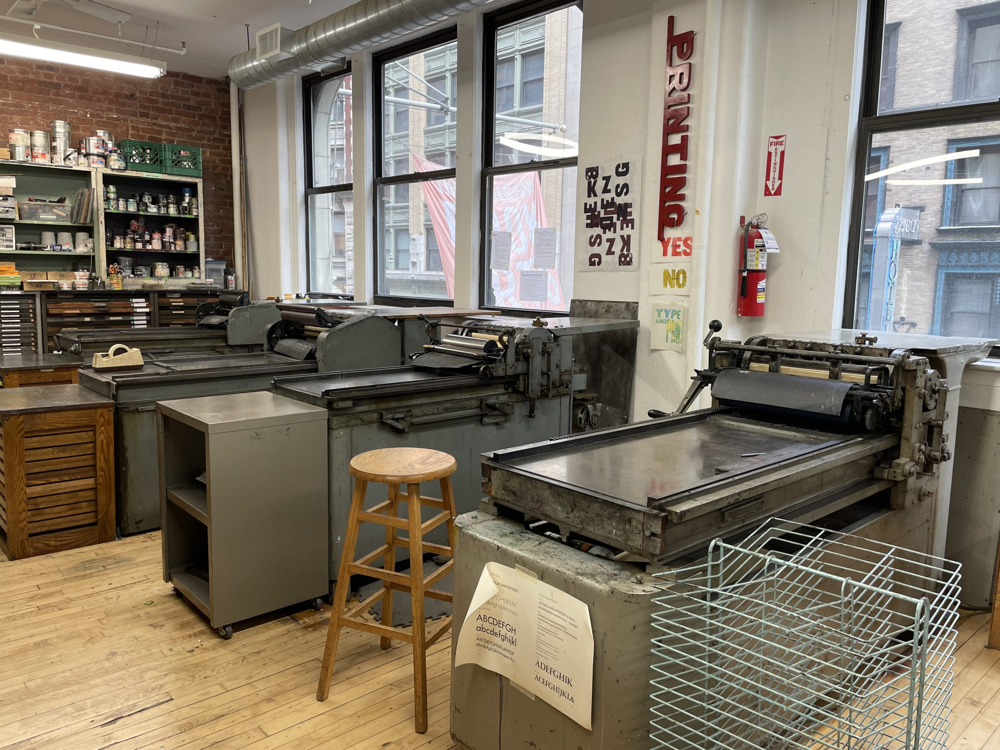

This weekend, I took a Letterpress course at the [Center for Book Arts](https://centerforbookarts.org/) in NYC. Though I love working with and reading about typography, most of my interactions with type have been mediated through a digital display. I was thrilled to get physical. To touch the type!

We learned about the Vandercook proof press, an imposing steel machine from the early 20th century. We selected typefaces from the Center’s many cases of lead type. And over the course of two days, each of us set a page of text to print.

<figure class="no-bleed">

  <figcaption>
    **Vandercook proof presses.** Located at the Center for Book Arts.
  </figcaption>
</figure>

Letterpress is slow, methodical work. Instructor Sarah Nicholls says it “reshapes your relation to time.” Every letter, space, and detail is placed individually, entire forms composed by hand. Nicholls uses letterpress as the final step in her editing process—it forces deep consideration of every word’s purpose.

<figure>

  <figcaption>
    **Letterpress workstation.** On the left, a case of 18pt Caslon #540 lead type. Above, a placement guide using the [California job case](https://en.wikipedia.org/wiki/California_job_case). On the right, a metal galley plate and composition stick, where type is being arranged.
  </figcaption>
</figure>

Setting each character within the composition stick, you feel the shape of words. Physically, yes, but linguistically, too. There is a poetry to the shapes that form language.

As I composed my page, letter by letter, I thought about friction. Friction shapes our relation to a system. It is difficult to set type in letterpress, so I say less, with more intention. It is easy to type on a computer, so I say more. If I wanted to set this blog post in letterpress, it would take me a week or more. Would I use all of these words?

<figure>
  

    

    

  

  <figcaption>
    **Setting type for print.** Blocks are arranged individually on a composition stick, then moved to a galley before being placed and secured on the Vandercook press for printing.
  </figcaption>
</figure>

Tools like ChatGPT take friction(-lessness) to a new extreme, where even writing is not required: only a rough impulse about the result you want. What do we lose when we abandon taking time to shape language? What meaning is made from pressing buttons on a text extrusion machine?

Tech often prizes frictionless experiences. Is lack of friction always a worthwhile goal? Deep consideration requires time. Learning requires time. Friction forces us to take time.

Sometimes the most valuable experiences are the slow ones, full of friction.

<figure class="no-bleed">

  <figcaption>
    **Taoing, from [Tao Te Ching](https://en.wikipedia.org/wiki/Tao_Te_Ching) by Lao Tzu, translated by Ursula K. Le Guin.** Title set in [Lydian Condensed Bold](https://fontsinuse.com/typefaces/6/lydian), 48pt. Text set in [Caslon #540](https://fontsinuse.com/typefaces/5488/caslon-no-471-and-540), 18pt. Typeset and printed by Eva Decker at the [Center for Book Arts](https://centerforbookarts.org/).
  </figcaption>
</figure>

---

The Center for Book Arts offers many [workshops](https://shop.centerforbookarts.org/collections/workshops) for letterpress, risograph printing, book binding, and more. I sincerely recommend taking a class if you're in the NYC area.