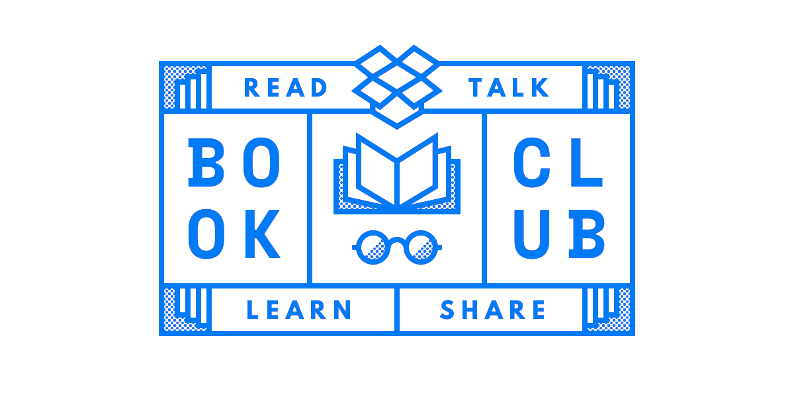

## Background

I joined Dropbox in November 2016 as a Product Designer. During my two year tenure, I worked on three core projects:

1. **Journey Builder**, an internal tool to enable more efficient and intelligent cross-channel messaging to users across email and in-product notifications.
2. **Dropbox Showcase**, a new product (now sunset) for creatives to present their work to clients for feedback.
3. **Dropbox File Comments**, a visual refresh with new support for time-coded comments on audio and video files.

In addition, I assisted with the [2017 Dropbox rebrand](https://blog.dropbox.com/topics/company/-dropbox-unveils-colorful-new-look-and-global-brand-campaign-foc) by updating and pixel-hinting desktop iconography across Windows, Mac, and Linux.

Below are a collection of sketches and visual assets for all three projects.

<figure class="no-bleed" style="max-width: 400px">
  (quality:100)
  <figcaption>
    **Annotation markers.** Various visual treatments for annotation markers on
    PDFs and other documents.
  </figcaption>
</figure>

<figure class="no-bleed" style="max-width: 600px">
  (quality:100)
  <figcaption>
    **Book club.** I organized and facilitated Dropbox Design book club for two
    years, making this banner and reading a new book together each month.
  </figcaption>
</figure>
