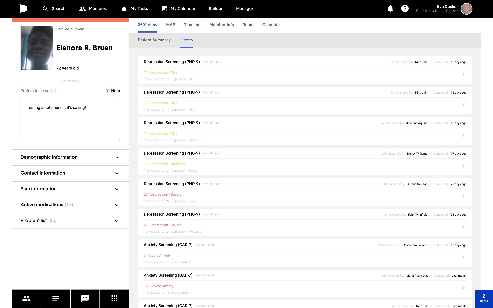
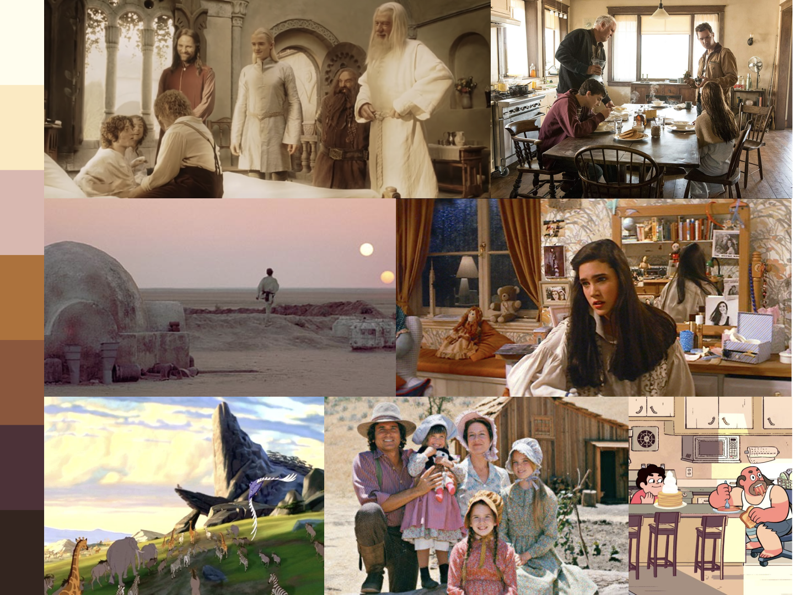

## Background

[Cityblock](https://www.cityblock.com/) is a health company which first got its start within Google's [Sidewalk Labs](https://www.sidewalklabs.com/). Teams of clinicians and other health professionals provide in-community care to people on Medicare and Medicaid, aiming to improve health for an often-neglected population.

<figure>
  <video
    controls
    playsinline
    preload="none"
    poster="/video/cityblock-member-story-poster.png"
  >
    <source src="/video/cityblock-member-story.mp4" type="video/mp4" />
  </video>
  <figcaption>
    **Andre, a Cityblock member, tells his story.** Via{" "}
    <a href="https://vimeo.com/796683739">Vimeo</a>, 2023.
  </figcaption>
</figure>

To support care teams and the members they serve, Cityblock builds and maintains a tool called **Commons**. I joined Cityblock in February 2019 as a Product Designer and recognized a need for a more systematic approach to design. Over the following two years, I built and expanded a design system in Figma and React. I named it **Commonplace**.

## The Challenge

Despite Cityblock's young age (it was founded in 2017), by 2019, Commons already offered a sprawling set of features, including: tracking member status, charting member acuity, coordinating member outreach, storing and editing core demographics, viewing health history, scheduling events, managing tasks for individuals and teams, creating and administering health assessments with automated scoring, texting members... all that, and more planned.

These features all converged in an interface that looked like this:

<figure>
  
  <figcaption>
    **The appearance of Commons when I joined Cityblock.** Here, in the
    right-hand drawer, a user is composing a progress note about the current
    member. The varying colors, typography, and hierarchy make the interface
    difficult to understand. All member data displayed in this case study is
    notional.
  </figcaption>
</figure>

Although there were some underlying commonalities and shared language throughout the product, **the design was not scaling to meet the needs of its users or developers.**

A lack of systemization was leading to longer development times, more time spent on undifferentiated work, more bugs in the product, and a user experience that was inconsistent and confusing. These problems would only worsen as Cityblock grew.

## Mapping the Territory

Together with Cityblock's Director of Design, [Neves](https://www.nevesrodrigues.com/), we began by cataloguing the available views. I conducted a product audit, clicking through and taking screenshots of every view, dialog, drawer, and dropdown within Commons. The images were then organized into folders for future reference.

<figure>
  <video
    autoplay
    loop
    muted
    playsinline
    preload="none"
    poster="/video/product-audit-poster.png"
  >
    <source src="/video/product-audit.mp4" type="video/mp4" />
  </video>
  <figcaption>
    **A product audit.** We captured screenshots from every corner of Commons
    and organized them in folders corresponding to the app's information
    architecture.
  </figcaption>
</figure>

The product audit helped understand the current state of Commons, and it served as a wonderful archival practice for the future. Throughout my tenure at Cityblock, I would continue to catalogue product interfaces at least once a year.

Following the product audit, we created an [interface inventory](https://bradfrost.com/blog/post/interface-inventory/), collecting all variations and permutations of each component and displaying a collage of those permutations on a large poster board.

<figure>
  
  <figcaption>
    **The interface inventory.** The product audit screenshots were used to
    create a collage of each component's variations. How many header styles can
    you count?
  </figcaption>
</figure>

This inventory allowed us to more easily spot inconsistencies and discuss how best to resolve them across the system.

## Laying Foundations

Once the interface inventory was complete, we began to focus on design foundations—typography, color, and spacing. All components rest on top of these three primitives, and we wanted to get the essentials right.

### Typography

Care team members at Cityblock were each given a small Chromebook. They used this device to access Commons in many locations—in the office, at community hubs, in members' homes, and in their car or on the subway.

It was essential, then, to design a typographic scale and provide suitable contrast to ensure that care teams could easily read Commons on a sub-standard display in a variety of real-world, less-than-ideal lighting conditions.

<figure>
  
  <figcaption>
    **Low-contrast typography within Commons.** Many views contained small,
    light text which was difficult to read under ideal conditions, and
    practically impossible in others. All data is notional.
  </figcaption>
</figure>

With Cityblock's brand designer, [Minji](https://www.linkedin.com/in/minji-lee-ba045518/), we tested various typefaces for the product before landing on [Graphik](https://commercialtype.com/catalog/graphik) for its legibility and understated friendliness. All text colors within the new design system would adhere to [WCAG AA](https://www.w3.org/WAI/WCAG21/Understanding/contrast-minimum) or [AAA](https://www.w3.org/WAI/WCAG21/Understanding/contrast-enhanced) contrast ratios.

### Color

We considered colors for the product, prioritizing their pure function, their accessibility and contrast, their relation to the brand, and their coherence as a whole.

I also examined the use of color in film to portray two separate settings—the hospital and the home.

<figure>
  

    

    

  

  <figcaption>
    **Colors of the hospital, and colors of home.**
  </figcaption>
</figure>

The hospital blue-greens are distinctly clinical, down to the robes worn by patients and doctors, and feel somber and sterile. “Home” tones, in contrast, emit a warm, welcoming glow. I wrote at the time, "Cityblock should feel less like the hospital, and more like home."

This led to guiding principles:

> **Guiding Principles for Color in Commons**
>
> 1. **Color gently.** Opt for soft, subdued tones. Avoid highly-saturated, electric colors.
> 2. **Use high contrast elements sparingly.** What is the one action on any given view that deserves attention?
> 3. **Skew warm.** Do not tint neutrals blue.

And the resulting palette:

<figure>
  
  <figcaption>
    **The color palette.** Colors are arranged along a spectrum from 100 (light)
    to 900 (dark). Some colors are aliased with a semantic name, so developers
    don't need to remember that icons are `--color-neutral-600`. They can just
    use `--color-icon`.
  </figcaption>
</figure>

### Spacing

We agreed to use an 8px grid for all components, and we agreed on specific fixed widths for sidebars while leaving the rest of the app responsive to scale with the browser.

## Building in Code

Once foundations were in place, primitives were set up both in Figma and as CSS Variables in the codebase, and we were able to quickly and easily replace all existing hex codes with new color variables, existing padding, margin, widths, and heights with the new spacing scale, and swap out the typography.

## Outcomes

Incididunt fugiat non enim enim sunt laborum. Minim commodo consequat incididunt est adipisicing. Aute et nostrud amet culpa cupidatat sit anim deserunt officia veniam ex. Pariatur reprehenderit eu adipisicing ut Lorem consectetur sit cillum laboris sit eiusmod Lorem est. Nisi et et anim sint.

## Reflections

Sit cupidatat sint do sit. Ex qui occaecat dolor irure magna irure excepteur do. Enim laborum quis ea irure minim culpa do tempor ullamco.
