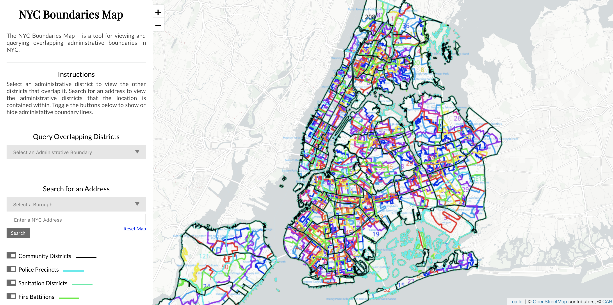

## Background

[BetaNYC](https://beta.nyc/) is a non-profit civic tech organization which builds tools and hosts public events to increase access to civic data and demystify government processes. I joined BetaNYC for 8 weeks during Summer 2022 as a Civic Innovation Fellow.

<figure>
  
  <figcaption>
    **BetaNYC operates out of the Manhattan Municipal Building at 1 Centre
    Street.** Technologists work alongside urban planners and other city
    professionals. Photo by Mattia Panciroli via
    [Flickr](https://flic.kr/p/bPBHUc), 2012.
  </figcaption>
</figure>

## The Challenge

BetaNYC maintains an open source web app called [NYC Boundaries Map](https://boundaries.beta.nyc/). First launched in 2018, the Boundaries Map allows anyone to view and explore overlapping jurisdictional boundaries within the city. The map is commonly used by city council staff and community boards in order to direct feedback from constituents to the correct department.

The Boundaries Map helps answer questions like, "which school districts does this community board serve?", "which sanitation district do I contact about the trash at 2nd Avenue and East 14th Street?", and "what police precinct am I in right now?"

However, the map was not pleasant to use.

<figure>
  
  <figcaption>
    **The original Boundaries Map.** 13 separate boundaries render with 13
    separate border colors and labels. A rainbow spaghetti of geographic data.
  </figcaption>
</figure>

Working together with [Zhi](https://github.com/zhik), we noted several usability issues:

1. Toggling on more than two districts quickly made the map illegible.
2. Boundaries on the map itself were not interactive.
3. The map's implementation in [Leaflet](https://leafletjs.com/) resulted in rasterized borders and labels, which looked blurry on high-DPI screens.
4. The map required frequent manual zooming and panning, since it did not adapt automatically to queries.
5. Viewing overlaps required a complex sequence of "querying" boundaries by selecting an administrative region and then selecting which district to intersect with, and the query itself was slow to execute.
6. Searching for an address required pre-selecting a borough.
7. Viewing additional metadata about a district required leaving the app and searching Google.
8. The app was desktop-only.
9. Visual design polish was generally lacking.

Additionally, there was no frontend framework in use (!) and I felt there was an opportunity to modernize and speed up development by adding one.

## Research and Build

With a solid list of usability tickets to address, I got to work sketching ideas for how we might fit things together.

<figure>
  
  <figcaption>
    **Sketching ideas.** I explored how we might combine location search,
    district browsing, and overlap browsing within a single interface.
  </figcaption>
</figure>

Without delay, we dove into code. After quick exploration with various frontend libraries, I installed [Svelte](https://svelte.dev/) and [Tailwind](https://tailwindcss.com/), which would allow us to build more advanced functionality more easily. We moved from Leaflet to [Mapbox](https://www.mapbox.com/) since it offered us exciting opportunities to interact with the map directly.

Additionally, we scheduled video calls with some frequent users of the Boundaries Map in order to better understand how they were using the tool and what could be improved. We shared our work-in-progress prototype for feedback. The participants were excited to be a part of the process and helped validate assumptions we had made.

## Outcomes

After a few short weeks, we announced the updated app.

<figure>
  <video
    autoplay
    loop
    muted
    playsinline
    preload="none"
    poster="/video/boundaries-map-poster.png"
  >
    <source src="/video/boundaries-map.mp4" type="video/mp4" />
  </video>
  <figcaption>
    **The new Boundaries Map.** The updated app features overlaps on hover,
    direct interaction with the map, a unified navigation bar, and clearer
    information hierarchy.
  </figcaption>
</figure>

The new map automatically zooms and pans to the selected boundaries, displays boundary overlaps on hover, allows single-click filtering by clicking any boundary, and supports mobile viewing. It also links out to relevant webpages for a district when available, so you can quickly jump to get additional info about a specific community bound, city council district, and more. We also introduced the ability to share a filtered view via URL, and export overlaps to JSON for analysis in other tools.

[Read the announcement](https://beta.nyc/2022/09/07/summer-associates-wrap-up/) or [explore boundaries](https://boundaries.beta.nyc/?).

## Reflections

I had never worked with mapping technology before, so it was fun to learn about how to wield geospatial data using Mapbox. (Huge thanks to [Zhi](https://github.com/zhik) sharing his knowledge of GeoJSON and Shapefiles!) Svelte and Tailwind were also new frameworks for me, and this project helped me get more familiar with their capabilities.

With extra time, I'd explore how to improve mobile navigation, since touchscreens can't support the same hover interactions as desktop. I'd also explore whether it's worth introducing color to the base map to more clearly communicate the locations of parks, water, and other regions. (Boundaries Map is [open source](https://github.com/BetaNYC/nyc-boundaries), so maybe I'll get to these one day! Or maybe you can, dear reader.)

BetaNYC introduced me to the city's vast library of [open data](https://opendata.cityofnewyork.us/), and I've continued to think about other possibilities for design and technology to surface public data for good.
