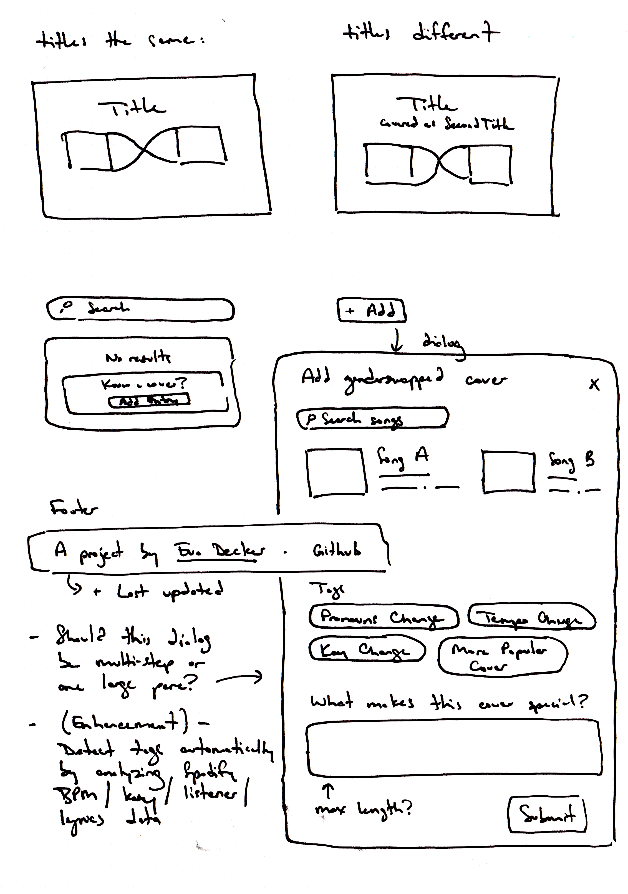
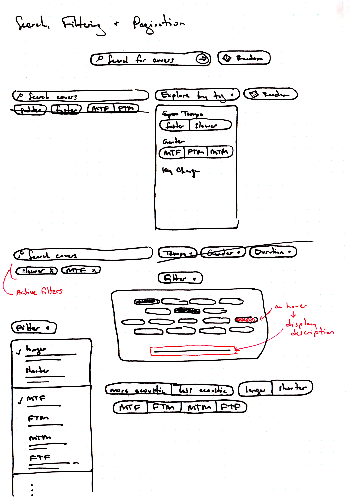

## Background

In 2021, I read the novel _[Paul Takes the Form of a Mortal Girl](https://www.goodreads.com/en/book/show/35838277)_ by Andrea Lawlor. Early in the book, Paul gushes about his love of gender-swapped covers:

> Some covers deliver the age-old simple pleasures of drag—knowledge, the opportunity to investigate the simulacra and make comparisons, that obscure little frisson of dissonance. Take Joan Baez singing “Virgil Kane is my name… like my father before me, I’m a working man” (which, of course, is originally from The Band’s “The Night They Drove Old Dixie Down)” or Cait O’Riordan from the Pogues crooning, “My name is Jock Stewart, I’m a canny gun man” (from the traditional “I’m a Man You Don’t Meet Every Day”). Joan Baez’s contralto can, if you squint your ears, pass as a farm-boy tenor; Cait O’Riordan’s chalky delivery might be that of a rich ponce.

I listened to each cover and original, enamored with how lyrics could completely transform under another artist's tone, tempo, and gender.

I began compiling Paul's songs into a playlist, and then I added more of my own. And more. And more. For another two years.

## The Challenge

As my covers playlist grew, so did the tedium of managing it in Spotify. I kept all covers alphabetized (by hand), and I maintained two separate playlists—one for both [covers and originals](https://open.spotify.com/playlist/5YQ4AyxQ6DeDxKJgSryAU2?si=68e701a76c854e5c), and another for [covers only](https://open.spotify.com/playlist/50iUGmY3cSUETCHGfUgf6a?si=f078e27420334399).

<figure>
  

    <video
      autoplay
      loop
      muted
      playsinline
      preload="none"
      poster="/video/adding-spotify-poster.png"
    >
      <source src="/video/adding-spotify.mp4" type="video/mp4" />
    </video>
  

  <figcaption>
    **Difficulties organizing in Spotify.** The interface makes it challenging
    to organize songs within large playlists. (Sorting by title exists, but it's
    unreliable here—John Denver's "Take Me Home, Country Roads" deserves to live
    beside Judy Collins's "Leaving on a Jet Plane/Take Me Home Country Roads".)
  </figcaption>
</figure>

After managing this playlist for two years, I decided to build a custom solution to host and catalogue covers. I named it [Genderswap.fm](https://genderswap.fm/).

## Laying Foundations

This personal project was my first time working directly on the backend. Thankfully, [Supabase](https://supabase.com/)—an open source alternative to Google's [Firebase](https://firebase.google.com/)—made it easy to get started.

I experimented with alternative data structures and landed on a two table model: one table for `songs`, and one table for `covers`, which links two `song` rows together along with extra metadata about their relation.

<figure class="no-bleed" style="max-width: 600px">
  (quality:100)
  <figcaption>
    **Database schema.** This is the shape of the data for Genderswap.fm.
  </figcaption>
</figure>

I decided to use [Svelte](https://svelte.dev/) and [SvelteKit](https://kit.svelte.dev/]) for my application framework. I had previously used Svelte in my build for the [NYC Boundaries Map](/projects/boundaries-map), and the addition of SvelteKit made it easy to manage routing, server-side rendering, and API requests. I set up a Spotify Developer account and used the [Spotify Web API TypeScript SDK](https://github.com/spotify/spotify-web-api-ts-sdk) to make it easy for users to search for and enter songs. I also added [Melt UI](https://melt-ui.com/), a Svelte-based component library, to help build the submission form.

## Ideation

For the design, I knew I wanted to allow users to browse by pairs of songs shown together. It wouldn't be too different from browsing "by album" in any other music tool, but rather than displaying a single album for each result, I'd display original/cover pairs.

From there, users could tap in to view the details of a cover, and listen to the original and the cover side-by-side, with notes about their differences.

<figure>
  

    

    (quality:100)

  

  <figcaption>
    **Exploratory sketches.** Ideating around the display of albums, how to structure the submission form, and how to surface filters. I still hadn't figured out what I would ask users to tag manually, and what I could tag automatically using Spotify's API.
  </figcaption>
</figure>

## Finding a Design Language

To communicate the way these covers remix sound, reinterpret lyrics, and reconfigure meaning, I established a visual motif to thread its way through the app: two objects, overlapping and askew. Sharing space, but different.

<figure>
  (quality:100)
  <figcaption>
    **Overlapping visual motif.** Intentional overlapping groups the original
    and cover as a single unit. The cover album is larger and foregrounded for
    emphasis.
  </figcaption>
</figure>

Typography is set in [Labil Grotesk](https://www.kometa.xyz/typefaces/labil-grotesk/), a queer font which topples over itself, unable to rest upright, mirroring the off-kilter elements elsewhere in the app.

<figure class="no-bleed">
  (quality:100)
  <figcaption>
    **Labil Grotesk in use.** I love the way the 'O' falls over, ready to roll
    off the screen.
  </figcaption>
</figure>

While the topsy-turvy contextual alternates were enabled for page-level headings, I disabled them for smaller text to prioritize legibility.

## Little Big Features

As with all my work, I looked for opportunities to introduce small but meaningful details.

<figure class="no-bleed" style="max-width: 462px">
  (quality:100)
  <figcaption>
    **Automated tagging.** Covers are automatically tagged with over a dozen
    acoustic attributes comparing it to the original.
  </figcaption>
</figure>
<figure class="no-bleed" style="max-width: 502px">
  (quality:100)
  <figcaption>
    **Readable URLs and page titles.** Cover data is used to generate
    human-readable URLs while accommodating diacritics and non-Latin characters.
    For page titles, it'll convert 3 periods to an ellipsis, and straight quotes
    to curly quotes.
  </figcaption>
</figure>
<figure class="no-bleed" style="max-width: 364px">
  (quality:100)
  <figcaption>
    **"Covered as..."** Only shown when a cover's title diverges from the
    original, ignoring minor changes in punctuation or casing.
  </figcaption>
</figure>
<figure class="no-bleed" style="max-width: 388px">
  

    <video
      autoplay
      loop
      muted
      playsinline
      preload="none"
      poster="/video/earlier-release-poster.png"
    >
      <source src="/video/earlier-release.mp4" type="video/mp4" />
    </video>
  

  <figcaption>
    **Earlier release prompting.** Behind the scenes, the app will search for
    earlier album releases for your original song. If one is found, it'll prompt
    you to update your submission.
  </figcaption>
</figure>

In addition:

- There are custom Open Graph images for every cover, generated using Sharp.
- Confetti displays after a new submission.
- Extra song info will be stripped from the ends of song titles—so `Can't Get You out of My Head - Live at KEXP` will become simply `Can't Get You out of My Head`, and `What Was I Made For? [From The Motion Picture "Barbie"]` will be `What Was I Made For?`.
- The submission form will save your name between submissions so you don't have to re-enter it.
- The search input in the submission form will also accept a Spotify song URL, so you can paste directly from the app. This is especially helpful for songs that are difficult to search, like [this cover from Shigeo Sekito](https://genderswap.fm/cover/%E3%82%B5%E3%83%B3%E3%82%B7%E3%83%A3%E3%82%A4%E3%83%B3-%E3%82%BB%E3%82%AD%E3%83%88%E3%82%AA%E3%83%BB%E3%82%B7%E3%82%B1%E3%82%99%E3%82%AA).
- Dark and light mode are set automatically according to the user's color mode preference.
- There's a [random cover](https://genderswap.fm/random) link.

## Outcomes

I didn't have any massive ambitions for this app—it was mostly a way for me to learn new technology, and see if I could manage my covers library in a way that felt a little more natural. In that sense, it was a success!

After finishing the first version of the app, I emailed it to Andrea Lawlor, sharing how _Paul Takes the Form_ had inspired me. A few days later, I received this reply:

<figure class="no-bleed" style="max-width: 585px">
  (quality:100)
  <figcaption>
    **[Andrea Lawlor](https://www.anderlawlor.com/)'s reply.** You heard it
    here, folks. The coolest thing ever.
  </figcaption>
</figure>

I was overjoyed. Thanks, Andrea. Thanks, Paul.

Genderswap.fm is now showcased on [Made with Svelte](https://madewithsvelte.com/genderswap-fm) and the [Utopia.fyi Showcase](https://utopia.fyi/showcase).

## Reflections

There are many improvements I'd still love to make to the app. At the top of the list is an [in-app audio player](https://github.com/evadecker/genderswap.fm/issues/7). I'd also like [better search](https://github.com/evadecker/genderswap.fm/issues/133), a way to [automatically generate and sync the Genderswap.fm database to a Spotify playlist](https://github.com/evadecker/genderswap.fm/issues/16), and [more](https://github.com/evadecker/genderswap.fm/issues).

I learned a lot building this out. The backend is not as scary as it seems, and I taught myself that it's possible for me to build a full-stack app from start to finish! There's still more to learn there, so I hope to continue working on this project when I have time.

I track [all issues and ideas on GitHub](https://github.com/evadecker/genderswap.fm/issues), and contributions are welcome. Otherwise, [explore covers](https://genderswap.fm/) or [submit your own](https://genderswap.fm/new).
